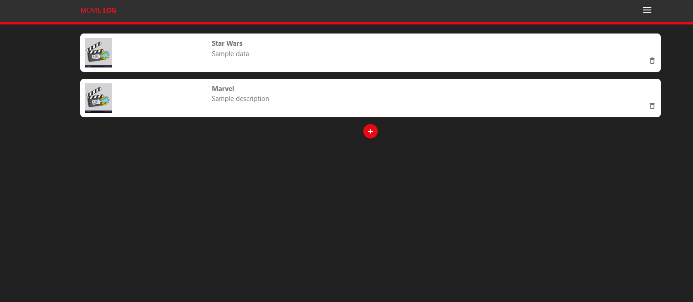
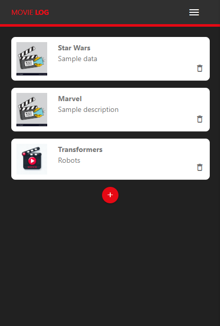
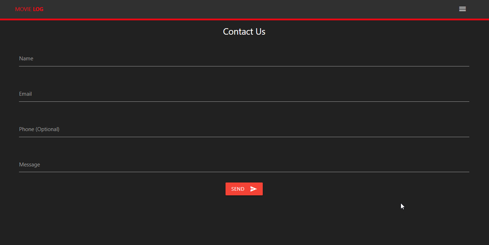

# INF654-Assignment - Prototype Web Application: Movie Log

This project is a web application utilizing the Materialize CSS framework to demonstrate a functional prototype/demo. It will mainly use HTML and CSS and demonstrate the struture and layout with functional mock-ups, using dummy images, and text for prototyping purposes. It is designed to catalog and manage a collection of movies like a watch list.

## Features

- Responsive design that adapts to different screen sizes for optimal user experience
- Interactive navigation menu for seamless user flow between different sections of the application.
- Ability to add new movie entries to the log with a user-friendly interface.
- ...

## Built With

- HTML, CSS, and JavaScript
- [Materialize CSS](https://materializecss.com/) - framework

## Setup / How to View the Prototype:

Clone the repository with `git clone https://github.com/HernandezA1007/INF654-Assignment.git`.
Open up index.html in your web browser and check out the prototype

## Gallery

Movie Log home page

Mobile view and side-form

    
    

Contact page

